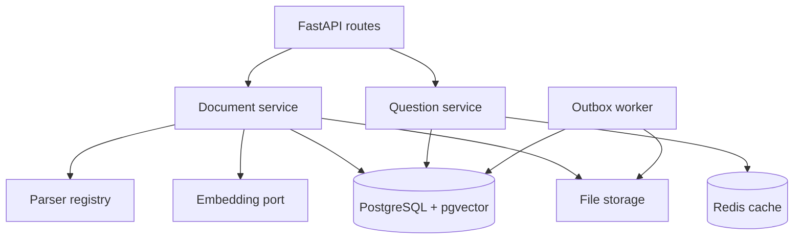

# 01 — Architecture and Theory

**Working directory:** none yet  
**Build output:** a mental model and a set of invariants  
**Do not write code until you can explain the state table below.**

## Why FastAPI and Python, not MERN, for this lab

MERN is excellent when the primary learning objective is a JavaScript product UI. Here, most
learning sits in the backend: embedding models, numerical operations, PDF extraction, pgvector,
ANN benchmarks, and Redis vector search. Python has direct, mature libraries for each. FastAPI
also uses Python type hints and Pydantic models to generate validation and OpenAPI documentation.

Use React later as an API consumer. Do not let a frontend consume the six-hour backend lab.

## Target architecture

The arrows point from a use case to a dependency. Application services depend on **ports**
(Python protocols), while infrastructure implements those ports. This is dependency inversion:
business flow knows what capability it needs, not which library supplies it.

## State ownership

| State | Owner | Durability | Why |
|---|---|---|---|
| Document identity/status | PostgreSQL | Authoritative | Constraints, locks, transactions |
| Chunk text and vectors | PostgreSQL + pgvector | Authoritative | Text/vector cannot drift apart |
| Knowledge-base version | PostgreSQL | Authoritative | Cache invalidation boundary |
| Cleanup request | PostgreSQL outbox | Authoritative until processed | Survives worker crashes |
| Uploaded bytes | Local storage in the lab | Durable but outside DB transaction | Replaceable with object storage |
| Prompt answer cache | Redis | Disposable | It may expire or be flushed safely |

### Invariants to defend

1. Every chunk belongs to exactly one document.
2. A READY document’s chunk text and vectors were created by the same ingestion recipe.
3. Every embedding has exactly 384 numbers.
4. Search returns chunks only from READY documents.
5. Removing a document makes its chunks unsearchable in the same DB commit.
6. Every cross-system cleanup has a durable outbox record before the DB commit succeeds.
7. Cache hits never cross tenant, knowledge-base version, embedding model, or answer-provider
   version.
8. Redis failure does not make authoritative search fail.

## Why not begin with a separate vector database?

With pgvector, the foreign key, document row, chunk text, vector, metadata filters, and version
counter share one transaction. This is ideal for learning and often sufficient in production.

Introduce a separate VDB only when evidence shows that you need independently scalable vector
compute, a particular distributed topology, special compression/index features, or workload
isolation that PostgreSQL cannot satisfy. A second database creates synchronization, retry,
deletion, reconciliation, and observability work.

## B-tree versus vector search

| Question | Correct structure |
|---|---|
| Find document ID `X` | B-tree primary key |
| Find active documents for one knowledge base | B-tree/partial index |
| Enforce one active copy of a SHA-256 hash | Unique B-tree index |
| Find the closest 5 embeddings | Exact scan or vector ANN index |

A B-tree gives an ordered structure for scalar equality and ranges. A vector index organizes a
high-dimensional neighborhood. Neither replaces the other; real vector queries normally combine
metadata filtering with vector ordering.

## Exact nearest neighbor versus ANN

Exact nearest-neighbor search calculates distance to every eligible vector. It gives perfect
recall but grows linearly with the number of candidates.

Approximate nearest-neighbor (ANN) search visits a promising subset. It trades some recall for
lower query time. “Approximate” does not mean random: it means the algorithm avoids exhaustive
comparison and may omit a true neighbor.

You will always benchmark ANN against exact results:

$$Recall@k=\frac{|ANN_k \cap Exact_k|}{k}$$

## PDF complexity: the honest answer

| PDF type | Complexity | This lab |
|---|---:|---|
| Digitally created, selectable text | Moderate | Supported with pypdf |
| OCRed scan with a hidden text layer | Moderate but text may be noisy | Accepted; inspect quality |
| Image-only scan | High | Rejected with `ocr_required` |
| Multi-column/table-heavy layout | High | Future layout-aware adapter |

PDF does not complicate vector search itself. It complicates **extraction and provenance**.
Keeping parsing behind a port prevents PDF-specific code from leaking into chunking, embeddings,
search, or deletion.

## ACID and the file-system boundary

- **Atomicity:** document state, chunk deletion, version increment, and outbox insert all succeed
  or all roll back.
- **Consistency:** foreign keys, uniqueness, lifecycle rules, and fixed vector dimension preserve
  valid state.
- **Isolation:** row locks serialize competing version/deletion changes.
- **Durability:** committed rows and outbox events survive process failure.

A file-system delete cannot join a PostgreSQL transaction. Therefore, “DB row and file are deleted
atomically” would be false. The outbox makes file deletion **durably eventually consistent**.

## Checkpoint

Before continuing, answer without looking:

1. Why is Redis not the source of truth?
2. What state changes must be in the document-delete transaction?
3. Why can a B-tree not answer “which 384-dimensional vector is closest?”
4. What makes scanned-PDF support materially harder than TXT support?
5. Why must an external VDB delete be idempotent?

Continue with `02_UV_SETUP_AND_PACKAGES.md`.

