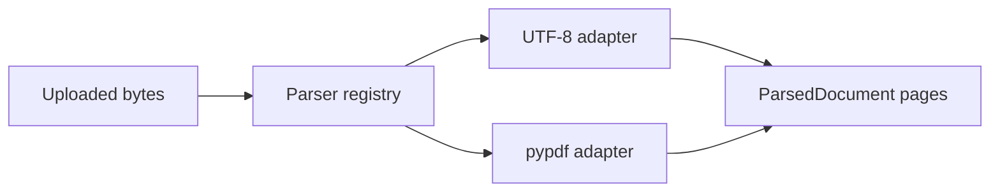

# 07 — TXT, Markdown, and PDF Parsers

**Working directory:** `policy-vault/`  
**Build output:** one replaceable parser boundary for three formats

## Parser design

Every parser returns the same `ParsedDocument`. The rest of the system does not know whether text
came from Markdown, a PDF page, OCR, or a future layout engine.



## Implement parsers

**File:** `policy-vault/app/infrastructure/parsers.py`

```python
"""Document extraction adapters. Parsing ends before chunking begins."""

from io import BytesIO
from pathlib import Path

from pypdf import PdfReader
from pypdf.errors import PdfReadError

from app.application.ports import DocumentParser
from app.core.errors import InvalidDocumentError, OCRRequiredError, UnsupportedDocumentError
from app.domain.models import ParsedDocument, ParsedPage


class Utf8TextParser:
    name = "utf8-text"
    extensions = frozenset({".txt", ".md"})

    def supports(self, filename: str, content_type: str, data: bytes) -> bool:
        # Extension selects the adapter; byte-level validation happens in parse().
        del content_type, data
        return Path(filename).suffix.lower() in self.extensions

    def parse(self, filename: str, content_type: str, data: bytes) -> ParsedDocument:
        del content_type
        if b"\x00" in data:
            raise InvalidDocumentError("Text files must not contain NUL bytes")
        try:
            text = data.decode("utf-8")
        except UnicodeDecodeError as exc:
            raise InvalidDocumentError("Text and Markdown files must be UTF-8 encoded") from exc
        if not text.strip():
            raise InvalidDocumentError("The document contains no text")
        return ParsedDocument(
            pages=(ParsedPage(page_number=1, text=text),),
            metadata={"parser": self.name, "source_extension": Path(filename).suffix.lower()},
        )


class PdfTextParser:
    """Extract an existing text layer page-by-page; deliberately does not hide OCR."""

    name = "pypdf-text-layer"

    def __init__(self, max_pages: int = 100) -> None:
        self.max_pages = max_pages

    def supports(self, filename: str, content_type: str, data: bytes) -> bool:
        del content_type, data
        return Path(filename).suffix.lower() == ".pdf"

    def parse(self, filename: str, content_type: str, data: bytes) -> ParsedDocument:
        del filename, content_type
        # Checking magic bytes catches a renamed non-PDF before deeper parsing.
        if not data.startswith(b"%PDF-"):
            raise InvalidDocumentError("A .pdf upload must have a valid PDF signature")
        try:
            reader = PdfReader(BytesIO(data), strict=False)
            if reader.is_encrypted:
                raise InvalidDocumentError("Encrypted PDFs are not supported")
            if len(reader.pages) > self.max_pages:
                raise InvalidDocumentError(
                    f"PDF has {len(reader.pages)} pages; limit is {self.max_pages}"
                )
            # Never merge pages here: page identity is evidence for citations.
            pages = tuple(
                ParsedPage(page_number=index, text=(page.extract_text() or ""))
                for index, page in enumerate(reader.pages, start=1)
            )
        except InvalidDocumentError:
            raise
        except (PdfReadError, ValueError, TypeError, KeyError) as exc:
            raise InvalidDocumentError("The PDF could not be parsed safely") from exc

        if not pages:
            raise InvalidDocumentError("The PDF has no pages")
        if not any(page.text.strip() for page in pages):
            # Empty extraction is not silently accepted as a searchable document.
            raise OCRRequiredError(
                "The PDF has no usable text layer; add an OCR parser for scanned documents"
            )
        return ParsedDocument(
            pages=pages,
            metadata={"parser": self.name, "pdf_pages": len(pages), "text_layer": True},
        )


class ParserRegistry:
    def __init__(self, parsers: tuple[DocumentParser, ...]) -> None:
        self._parsers = parsers

    def parse(self, filename: str, content_type: str, data: bytes) -> ParsedDocument:
        for parser in self._parsers:
            if parser.supports(filename, content_type, data):
                return parser.parse(filename, content_type, data)
        raise UnsupportedDocumentError("Only .txt, .md, and text-based .pdf are supported")
```

## Create a sample text document

**File:** `policy-vault/sample_data/handbook.txt`

```text
PolicyVault Employee Handbook

Learning budget

Every full-time employee receives an annual learning budget of 1,200 USD. Manager approval is
required before purchase. Reimbursement requests must include a receipt and be filed within
30 days.

Security

Enable multi-factor authentication on every supported service. Report a suspected security
incident immediately; do not wait until you confirm the cause.
```

## Manual parser checkpoint

First run Ruff:

```bash
uv run ruff check app/infrastructure/parsers.py
```

Then execute:

```bash
uv run python -c "from pathlib import Path; from app.infrastructure.parsers import Utf8TextParser; p=Path('sample_data/handbook.txt'); d=Utf8TextParser().parse(p.name,'text/plain',p.read_bytes()); print(d.pages[0].page_number, len(d.pages[0].text))"
```

Expected: page number `1` and a positive character count.

## What pypdf can and cannot promise

- It can extract text already encoded in a PDF.
- It cannot recognize letters inside an image-only scan.
- A PDF stores drawing instructions, not reliable semantic paragraphs or tables.
- Reading order can be ambiguous for columns, headers, footnotes, and positioned text.
- Upload byte/page limits are security and reliability controls, not optional polish.

Do not “solve” blank extraction by indexing an empty string. A scan must enter a visible OCR flow.

Commit:

```bash
git add app/infrastructure/parsers.py sample_data
git commit -m "feat: add extensible text and PDF parsers"
```

Continue with `08_CHUNKING_EMBEDDINGS_STORAGE.md`.
