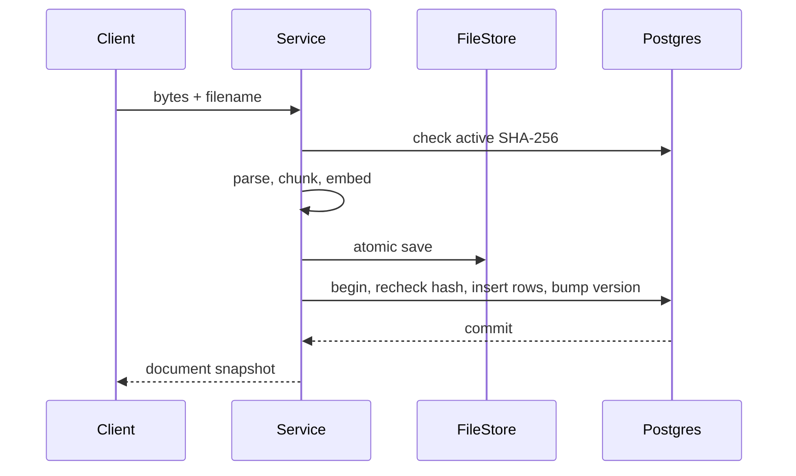

# 09 — Document Upload Use Case

**Working directory:** `policy-vault/`  
**Build output:** idempotent parse → chunk → embed → store → commit flow

## Transaction design before code

Parsing and embedding can be slow, so do them outside a database transaction. The short commit
contains document rows, chunk rows, and the knowledge-base version increment.



Why check the hash twice? Two identical concurrent requests can both pass the first read. The
second check happens inside the write transaction; the partial unique index is the final guard.

## Implement upload, list, and get

**File:** `policy-vault/app/application/document_service.py`

```python
"""Document lifecycle use cases; this layer decides transaction boundaries."""

import hashlib
from pathlib import Path, PurePosixPath
from uuid import UUID, uuid4

from sqlalchemy.exc import IntegrityError
from sqlalchemy.orm import sessionmaker

from app.application.ports import Embedder, FileStorage
from app.core.constants import DEFAULT_KNOWLEDGE_BASE_ID, SUPPORTED_EXTENSIONS
from app.core.errors import InvalidDocumentError, NotFoundError, UploadTooLargeError
from app.domain.models import DocumentSnapshot, DocumentStatus, TextChunk, UploadResult
from app.infrastructure.chunking import TextChunker
from app.infrastructure.orm import ChunkRow, DocumentRow
from app.infrastructure.parsers import ParserRegistry
from app.infrastructure.repositories import DocumentRepository, KnowledgeBaseRepository


class DocumentService:
    def __init__(
        self,
        session_factory: sessionmaker,
        parser_registry: ParserRegistry,
        chunker: TextChunker,
        embedder: Embedder,
        storage: FileStorage,
        max_upload_bytes: int,
    ) -> None:
        self.session_factory = session_factory
        self.parser_registry = parser_registry
        self.chunker = chunker
        self.embedder = embedder
        self.storage = storage
        self.max_upload_bytes = max_upload_bytes

    def upload(
        self,
        filename: str,
        content_type: str,
        data: bytes,
        knowledge_base_id: UUID = DEFAULT_KNOWLEDGE_BASE_ID,
    ) -> UploadResult:
        safe_name = self._validate_upload(filename, data)
        sha256 = hashlib.sha256(data).hexdigest()

        # Cheap idempotency check avoids repeated parsing/model inference on normal retries.
        with self.session_factory() as session:
            existing = DocumentRepository(session).find_active_by_sha(knowledge_base_id, sha256)
            if existing is not None:
                return UploadResult(document=existing, deduplicated=True)

        # Slow, fallible work happens with no database locks held.
        parsed = self.parser_registry.parse(safe_name, content_type, data)
        chunks = self.chunker.split(parsed)
        if not chunks:
            raise InvalidDocumentError("The document produced no searchable chunks")
        embeddings = self.embedder.embed_documents([chunk.content for chunk in chunks])
        if len(embeddings) != len(chunks):
            raise RuntimeError("Embedding provider returned the wrong vector count")
        if any(len(vector) != self.embedder.dimensions for vector in embeddings):
            raise RuntimeError("Embedding provider returned the wrong vector dimension")

        # Store bytes before DB commit. Exceptions compensate by deleting this new file.
        storage_key = self.storage.save(data, Path(safe_name).suffix)
        try:
            result = self._insert_document(
                knowledge_base_id=knowledge_base_id,
                filename=safe_name,
                content_type=content_type or "application/octet-stream",
                storage_key=storage_key,
                sha256=sha256,
                parsed_metadata=parsed.metadata,
                page_count=len(parsed.pages),
                chunks=chunks,
                embeddings=embeddings,
            )
        except IntegrityError as exc:
            # The unique index can resolve a race in favor of another request.
            self.storage.delete(storage_key)
            with self.session_factory() as session:
                winner = DocumentRepository(session).find_active_by_sha(
                    knowledge_base_id, sha256
                )
                if winner is not None:
                    return UploadResult(document=winner, deduplicated=True)
            raise exc
        except Exception:
            self.storage.delete(storage_key)
            raise

        # A concurrent transaction may have won during the in-transaction recheck.
        if result.deduplicated:
            self.storage.delete(storage_key)
        return result

    def _insert_document(
        self,
        *,
        knowledge_base_id: UUID,
        filename: str,
        content_type: str,
        storage_key: str,
        sha256: str,
        parsed_metadata: dict[str, object],
        page_count: int,
        chunks: list[TextChunk],
        embeddings: list[list[float]],
    ) -> UploadResult:
        # sessionmaker.begin() commits on success and rolls back on exceptions.
        with self.session_factory.begin() as session:
            repository = DocumentRepository(session)
            existing = repository.find_active_by_sha(knowledge_base_id, sha256)
            if existing is not None:
                return UploadResult(document=existing, deduplicated=True)

            document = DocumentRow(
                id=uuid4(),
                knowledge_base_id=knowledge_base_id,
                filename=filename,
                content_type=content_type,
                storage_key=storage_key,
                sha256=sha256,
                status=DocumentStatus.READY.value,
                page_count=page_count,
                metadata_json={
                    **parsed_metadata,
                    # Recipe metadata explains how stored vectors were produced.
                    "embedding_model": self.embedder.name,
                    "embedding_dimensions": self.embedder.dimensions,
                    "chunk_size": self.chunker.chunk_size,
                    "chunk_overlap": self.chunker.overlap,
                },
            )
            session.add(document)
            session.add_all(
                ChunkRow(
                    id=uuid4(),
                    document_id=document.id,
                    page_number=chunk.page_number,
                    chunk_index=chunk.chunk_index,
                    char_start=chunk.char_start,
                    char_end=chunk.char_end,
                    content=chunk.content,
                    embedding=embedding,
                )
                for chunk, embedding in zip(chunks, embeddings, strict=True)
            )
            # Any content change invalidates old semantic-cache scopes.
            KnowledgeBaseRepository(session).bump_version(knowledge_base_id)
            session.flush()
            snapshot = repository.get_snapshot(document.id)
            if snapshot is None:
                raise RuntimeError("Inserted document could not be reloaded")
            return UploadResult(document=snapshot, deduplicated=False)

    def list_documents(
        self, knowledge_base_id: UUID = DEFAULT_KNOWLEDGE_BASE_ID
    ) -> list[DocumentSnapshot]:
        with self.session_factory() as session:
            return DocumentRepository(session).list_active(knowledge_base_id)

    def get_document(self, document_id: UUID) -> DocumentSnapshot:
        with self.session_factory() as session:
            document = DocumentRepository(session).get_snapshot(document_id)
            if document is None:
                raise NotFoundError(f"Document {document_id} was not found")
            return document

    def _validate_upload(self, filename: str, data: bytes) -> str:
        # Normalize Windows separators before taking a basename to prevent path traversal.
        safe_name = PurePosixPath(filename.replace("\\", "/")).name.strip()
        if not safe_name or len(safe_name) > 255:
            raise InvalidDocumentError("A filename of at most 255 characters is required")
        suffix = Path(safe_name).suffix.lower()
        if suffix not in SUPPORTED_EXTENSIONS:
            raise InvalidDocumentError("Only .txt, .md, and .pdf files are accepted")
        if not data:
            raise InvalidDocumentError("The uploaded file is empty")
        if len(data) > self.max_upload_bytes:
            raise UploadTooLargeError(
                f"Upload is {len(data)} bytes; limit is {self.max_upload_bytes}"
            )
        if data.startswith(b"%PDF-") and suffix != ".pdf":
            raise InvalidDocumentError("PDF content must use the .pdf extension")
        return safe_name
```

The delete method intentionally arrives in Chapter 12 after you understand the ACID/outbox theory.

## Failure-boundary analysis

| Failure point | Result |
|---|---|
| Parse fails | No file and no DB row |
| Embedding fails | No file and no DB row |
| File save fails | No DB row |
| DB insert fails normally | New file is removed as compensation |
| Concurrent duplicate wins | Duplicate file is removed; existing row is returned |
| Process crashes after file save but before DB commit | Possible orphan file; production needs reconciliation |

The last row is important. Compensation handles exceptions, not power loss. A production object
store needs an orphan-reconciliation policy or a staged upload lifecycle.

## Checkpoint

```bash
uv run ruff check app/application/document_service.py
uv run mypy app
```

Commit:

```bash
git add app/application/document_service.py
git commit -m "feat: add idempotent document ingestion use case"
```

Continue with `10_VECTOR_MATH_AND_EXACT_SEARCH.md`.

