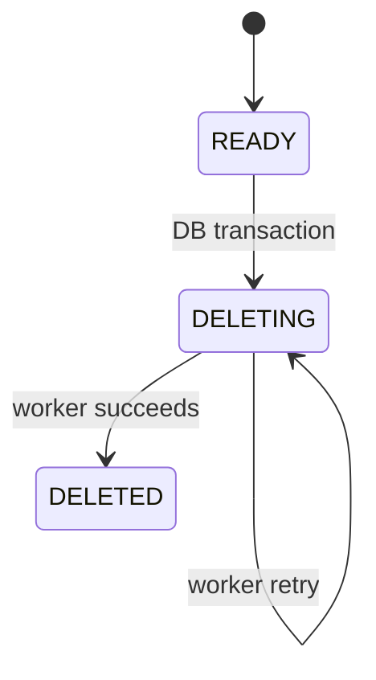

# 12 — ACID Delete and the Transactional Outbox

**Working directory:** `policy-vault/`  
**Build output:** immediate vector removal plus restart-safe file cleanup

## State transition



The API transaction does four things together:

1. locks the document;
2. deletes its pgvector chunks;
3. changes status to `DELETING` and increments knowledge-base version;
4. inserts a durable cleanup event.

Search stops seeing the document immediately. The worker later deletes the non-transactional file.

## 1. Extend the document service imports

**File to edit:** `policy-vault/app/application/document_service.py`

Change the SQLAlchemy import:

```python
from sqlalchemy import delete
```

Keep the existing `IntegrityError` import. Add `DeleteResult` to the domain import and
`OutboxEventRow` to the ORM import so the relevant imports become:

```python
from app.domain.models import (
    DeleteResult,
    DocumentSnapshot,
    DocumentStatus,
    TextChunk,
    UploadResult,
)
from app.infrastructure.orm import ChunkRow, DocumentRow, OutboxEventRow
```

## 2. Add deletion to `DocumentService`

**Location:** inside `DocumentService`, immediately before `_validate_upload`

```python
    def delete_document(self, document_id: UUID) -> DeleteResult:
        with self.session_factory.begin() as session:
            repository = DocumentRepository(session)
            document = repository.get_row_for_update(document_id)
            if document is None:
                raise NotFoundError(f"Document {document_id} was not found")

            status = DocumentStatus(document.status)
            # Idempotent API semantics make client retries safe.
            if status is DocumentStatus.DELETED:
                return DeleteResult(document.id, status, cleanup_pending=False)
            if status is DocumentStatus.DELETING:
                return DeleteResult(document.id, status, cleanup_pending=True)

            # Authoritative vectors disappear in the same commit as the cleanup request.
            session.execute(delete(ChunkRow).where(ChunkRow.document_id == document.id))
            document.status = DocumentStatus.DELETING.value
            KnowledgeBaseRepository(session).bump_version(document.knowledge_base_id)
            session.add(
                OutboxEventRow(
                    id=uuid4(),
                    event_type="DOCUMENT_FILE_DELETE",
                    aggregate_id=document.id,
                    payload={"storage_key": document.storage_key},
                )
            )
            return DeleteResult(document.id, DocumentStatus.DELETING, cleanup_pending=True)
```

## 3. Implement the worker use case

The worker claims one row with `FOR UPDATE SKIP LOCKED`. Multiple workers can operate without
claiming the same unlocked job. A lease allows recovery if one dies after claiming.

**File:** `policy-vault/app/application/outbox_service.py`

```python
"""Retryable processing for side effects that cannot join a PostgreSQL transaction."""

import logging
from dataclasses import dataclass
from datetime import UTC, datetime, timedelta
from uuid import UUID

from sqlalchemy import or_, select
from sqlalchemy.orm import sessionmaker

from app.application.ports import ExternalVectorStore, FileStorage
from app.domain.models import DocumentStatus
from app.infrastructure.orm import DocumentRow, OutboxEventRow

logger = logging.getLogger(__name__)


class NoOpExternalVectorStore:
    """Extension point: later delete external VDB points before completing the event."""

    def delete_document(self, document_id: UUID) -> None:
        del document_id


@dataclass(frozen=True, slots=True)
class OutboxJob:
    id: UUID
    event_type: str
    aggregate_id: UUID
    storage_key: str


class OutboxService:
    def __init__(
        self,
        session_factory: sessionmaker,
        storage: FileStorage,
        external_vectors: ExternalVectorStore,
        worker_id: str,
        lease_seconds: int,
    ) -> None:
        self.session_factory = session_factory
        self.storage = storage
        self.external_vectors = external_vectors
        self.worker_id = worker_id
        self.lease_seconds = lease_seconds

    def process_one(self) -> bool:
        job = self._claim_one()
        if job is None:
            return False
        try:
            if job.event_type != "DOCUMENT_FILE_DELETE":
                raise ValueError(f"Unsupported event type {job.event_type}")
            # Both operations must be idempotent because completion can fail after side effects.
            self.external_vectors.delete_document(job.aggregate_id)
            self.storage.delete(job.storage_key)
            self._complete(job)
        except Exception as exc:
            logger.exception("Outbox job %s failed", job.id)
            self._fail(job, exc)
        return True

    def _claim_one(self) -> OutboxJob | None:
        now = datetime.now(UTC)
        lease_expired = now - timedelta(seconds=self.lease_seconds)
        with self.session_factory.begin() as session:
            event = session.scalar(
                select(OutboxEventRow)
                .where(
                    OutboxEventRow.processed_at.is_(None),
                    or_(
                        OutboxEventRow.locked_at.is_(None),
                        OutboxEventRow.locked_at < lease_expired,
                    ),
                )
                .order_by(OutboxEventRow.created_at)
                .with_for_update(skip_locked=True)
                .limit(1)
            )
            if event is None:
                return None
            event.locked_at = now
            event.locked_by = self.worker_id
            event.attempts += 1
            return OutboxJob(
                id=event.id,
                event_type=event.event_type,
                aggregate_id=event.aggregate_id,
                storage_key=str(event.payload["storage_key"]),
            )

    def _complete(self, job: OutboxJob) -> None:
        with self.session_factory.begin() as session:
            event = session.get(OutboxEventRow, job.id, with_for_update=True)
            if event is None or event.processed_at is not None:
                return
            document = session.get(DocumentRow, job.aggregate_id, with_for_update=True)
            if document is not None:
                document.status = DocumentStatus.DELETED.value
                document.deleted_at = datetime.now(UTC)
            event.processed_at = datetime.now(UTC)
            event.locked_at = None
            event.locked_by = None
            event.last_error = None

    def _fail(self, job: OutboxJob, exc: Exception) -> None:
        with self.session_factory.begin() as session:
            event = session.get(OutboxEventRow, job.id, with_for_update=True)
            if event is None or event.processed_at is not None:
                return
            event.locked_at = None
            event.locked_by = None
            event.last_error = f"{type(exc).__name__}: {exc}"[:2000]
```

## 4. Add the long-running worker command

**File:** `policy-vault/scripts/process_outbox.py`

```python
"""Process cleanup events continuously or once for tests/operations."""

import argparse
import logging
import signal
import time

from app.infrastructure.container import get_container

stopping = False


def request_stop(signum: int, frame: object) -> None:
    del signum, frame
    global stopping
    stopping = True


def main() -> None:
    parser = argparse.ArgumentParser()
    parser.add_argument("--once", action="store_true")
    args = parser.parse_args()

    container = get_container()
    container.storage.prepare()
    service = container.build_outbox_service()
    signal.signal(signal.SIGTERM, request_stop)
    signal.signal(signal.SIGINT, request_stop)
    logging.basicConfig(level=container.settings.log_level)

    while not stopping:
        processed = service.process_one()
        if args.once:
            break
        if not processed:
            time.sleep(container.settings.outbox_poll_seconds)


if __name__ == "__main__":
    main()
```

`container.py` is intentionally introduced in Chapter 15. Until then, linting works but running
this worker does not.

## ACID reasoning exercise

For each crash, state what happens:

1. before the delete transaction commits;
2. after commit but before a worker claims the event;
3. after file deletion but before `_complete` commits;
4. after `_complete` commits.

Correct core insight: case 3 retries an already-completed file delete, so `missing_ok=True` and an
idempotent external VDB delete are mandatory.

## Checkpoint

```bash
uv run ruff check app/application scripts/process_outbox.py
uv run mypy app scripts
```

Commit:

```bash
git add app/application scripts/process_outbox.py
git commit -m "feat: add transactional outbox deletion flow"
```

Continue with `13_REDIS_SEMANTIC_CACHE.md`.
