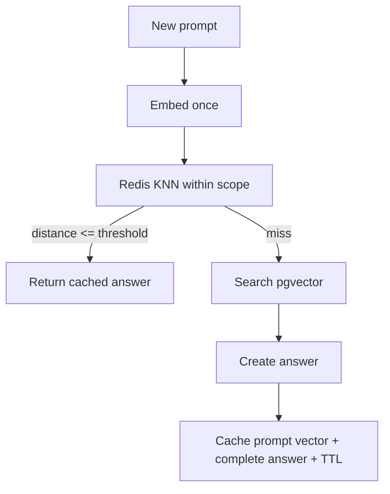

# 13 — Redis Semantic Vector Cache

**Working directory:** `policy-vault/`  
**Build output:** fail-open cache that finds semantically similar prompts

## What semantic caching changes

A normal cache requires an exact key. A semantic cache embeds the new prompt and searches cached
prompt vectors. If the nearest prompt is close enough and belongs to the same scope, return its
complete answer payload.



Risks:

- A loose threshold can serve the wrong answer.
- A scope missing tenant/model/data version can leak or stale-match answers.
- Caching only retrieved text still repeats answer generation; cache the final response.
- Redis downtime must not block authoritative retrieval.

## Implement the adapters

**File:** `policy-vault/app/infrastructure/cache.py`

```python
"""Redis vector cache with a no-op alternative and fail-open behavior."""

import logging
from collections.abc import Sequence
from uuid import uuid4

import numpy as np
from redis import Redis
from redis.exceptions import RedisError, ResponseError

from app.application.ports import CacheMatch

logger = logging.getLogger(__name__)


class NullSemanticCache:
    """Null Object avoids cache-related conditionals in application services."""

    def ensure_index(self) -> bool:
        return False

    def find(self, scope: str, query_embedding: Sequence[float]) -> CacheMatch | None:
        del scope, query_embedding
        return None

    def put(
        self,
        scope: str,
        prompt: str,
        embedding: Sequence[float],
        payload_json: str,
    ) -> None:
        del scope, prompt, embedding, payload_json

    def ping(self) -> bool:
        return False


class RedisSemanticCache:
    def __init__(
        self,
        redis_url: str,
        index_name: str,
        key_prefix: str,
        dimensions: int,
        ttl_seconds: int,
        distance_threshold: float,
    ) -> None:
        # Binary responses are required because embeddings are raw FLOAT32 bytes.
        self.client = Redis.from_url(redis_url, decode_responses=False)
        self.index_name = index_name
        self.key_prefix = key_prefix
        self.dimensions = dimensions
        self.ttl_seconds = ttl_seconds
        self.distance_threshold = distance_threshold

    def ensure_index(self) -> bool:
        try:
            from redis.commands.search.field import TagField, TextField, VectorField
            from redis.commands.search.index_definition import IndexDefinition, IndexType

            try:
                self.client.ft(self.index_name).info()
                return True
            except ResponseError as exc:
                message = str(exc).lower()
                if "unknown index name" not in message and "no such index" not in message:
                    raise

            self.client.ft(self.index_name).create_index(
                [
                    # Scope is an exact tag filter, never a semantic field.
                    TagField("scope"),
                    TextField("prompt"),
                    VectorField(
                        "embedding",
                        "HNSW",
                        {
                            "TYPE": "FLOAT32",
                            "DIM": self.dimensions,
                            "DISTANCE_METRIC": "COSINE",
                            "M": 16,
                            "EF_CONSTRUCTION": 200,
                        },
                    ),
                ],
                definition=IndexDefinition(
                    prefix=[self.key_prefix],
                    index_type=IndexType.HASH,
                ),
            )
            return True
        except (ImportError, RedisError):
            # Cache unavailability is logged but does not stop the source-of-truth API.
            logger.warning("Semantic cache index is unavailable", exc_info=True)
            return False

    def find(self, scope: str, query_embedding: Sequence[float]) -> CacheMatch | None:
        try:
            from redis.commands.search.query import Query

            # First apply exact scope, then KNN among only compatible cache records.
            query = (
                Query(f"(@scope:{{{scope}}})=>[KNN 1 @embedding $query AS vector_distance]")
                .sort_by("vector_distance")
                .return_fields("payload", "vector_distance")
                .paging(0, 1)
                .dialect(2)
            )
            result = self.client.ft(self.index_name).search(
                query,
                query_params={"query": self._vector_bytes(query_embedding)},
            )
            if not result.docs:
                return None
            document = result.docs[0]
            distance = float(document.vector_distance)
            if distance > self.distance_threshold:
                return None
            raw_payload = document.payload
            payload = (
                raw_payload.decode("utf-8")
                if isinstance(raw_payload, bytes)
                else str(raw_payload)
            )
            return CacheMatch(payload_json=payload, distance=distance)
        except (ImportError, RedisError, AttributeError, ValueError):
            logger.warning("Semantic cache lookup failed open", exc_info=True)
            return None

    def put(
        self,
        scope: str,
        prompt: str,
        embedding: Sequence[float],
        payload_json: str,
    ) -> None:
        try:
            key = f"{self.key_prefix}{uuid4().hex}"
            # Transactional pipeline prevents a hash without its TTL under normal execution.
            pipeline = self.client.pipeline(transaction=True)
            pipeline.hset(
                key,
                mapping={
                    "scope": scope,
                    "prompt": prompt,
                    "payload": payload_json,
                    "embedding": self._vector_bytes(embedding),
                },
            )
            pipeline.expire(key, self.ttl_seconds)
            pipeline.execute()
        except RedisError:
            logger.warning("Semantic cache write failed open", exc_info=True)

    def ping(self) -> bool:
        try:
            return bool(self.client.ping())
        except RedisError:
            return False

    def _vector_bytes(self, embedding: Sequence[float]) -> bytes:
        vector = np.asarray(embedding, dtype=np.float32)
        if vector.shape != (self.dimensions,):
            raise ValueError(f"Expected a {self.dimensions}-dimensional vector")
        return vector.tobytes()
```

## Why HNSW in Redis?

This cache receives new answers continuously. HNSW supports incremental inserts and fast KNN
lookups. FLAT is a useful exact baseline for a small cache; SVS-VAMANA is another Redis option on
supported deployments. HNSW is chosen here so you practice graph search in both PostgreSQL and
Redis while still treating Redis as disposable.

## Threshold theory

Cosine distance `0` means identical direction. A threshold of `0.12` means a hit requires cosine
similarity of at least `0.88`. This is only a starting hypothesis. Build an evaluation set with:

- true paraphrases that should hit;
- related but different questions that must miss;
- negations (“is allowed” versus “is not allowed”);
- entity/number changes;
- cross-tenant and old-version cases.

Measure false-hit rate before measuring cost savings. A wrong cached answer is worse than a miss.

## Checkpoint

The adapter can validate serialization without connecting:

```bash
uv run python -c "from app.infrastructure.cache import RedisSemanticCache; c=RedisSemanticCache('redis://localhost:6379','i','p:',384,60,.12); print(len(c._vector_bytes([0.0]*384)))"
```

Expected: `1536` bytes (`384 × 4`).

The index will be created during FastAPI startup in Chapter 15.

Commit:

```bash
git add app/infrastructure/cache.py
git commit -m "feat: add Redis semantic vector cache"
```

Continue with `14_ASK_FLOW_AND_CACHE_SCOPE.md`.

